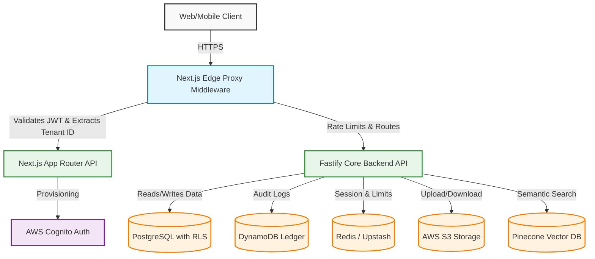

# VOXA System Architecture

This diagram outlines the high-level system architecture of the VOXA SaaS platform, illustrating how traffic flows from the client through the edge proxy, into the Next.js and Fastify backend, and down to the various data stores.

