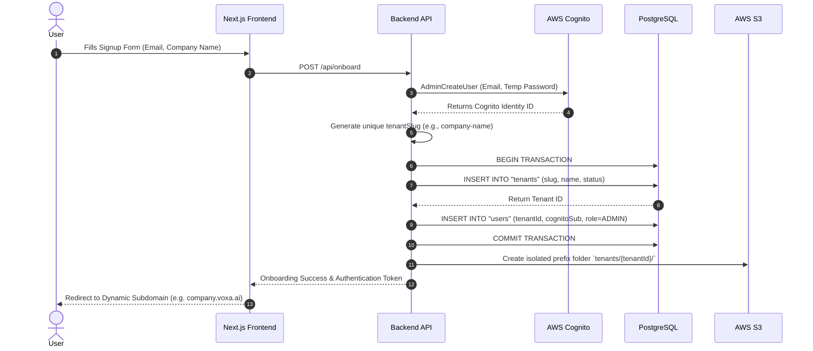

# SaaS Onboarding Workflow

This sequence diagram maps the multi-tenant onboarding flow, from user registration through AWS Cognito provisioning, all the way to isolated database creation.

```mermaid
sequenceDiagram
    autonumber
    actor User
    participant Frontend as Next.js Frontend
    participant Backend as Backend API
    participant Cognito as AWS Cognito
    participant Postgres as PostgreSQL
    participant S3 as AWS S3
    
    User->>Frontend: Fills Signup Form (Email, Company Name)
    Frontend->>Backend: POST /api/onboard
    Backend->>Cognito: AdminCreateUser (Email, Temp Password)
    Cognito-->>Backend: Returns Cognito Identity ID
    
    Backend->>Backend: Generate unique tenantSlug (e.g., company-name)
    
    Backend->>Postgres: BEGIN TRANSACTION
    Backend->>Postgres: INSERT INTO "tenants" (slug, name, status)
    Postgres-->>Backend: Return Tenant ID
    Backend->>Postgres: INSERT INTO "users" (tenantId, cognitoSub, role=ADMIN)
    Backend->>Postgres: COMMIT TRANSACTION
    
    Backend->>S3: Create isolated prefix folder `tenants/{tenantId}/`
    
    Backend-->>Frontend: Onboarding Success & Authentication Token
    Frontend-->>User: Redirect to Dynamic Subdomain (e.g. company.voxa.ai)
```
