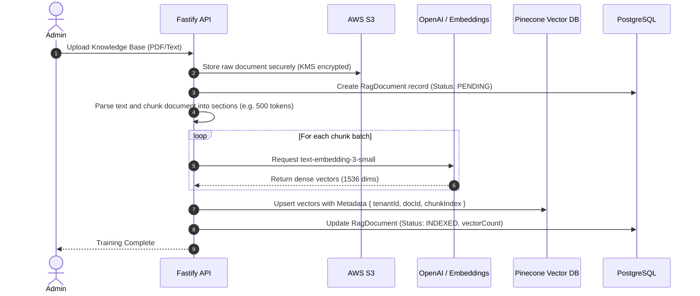

# Vector Training Data Flow

This diagram explains how raw knowledge base documents are ingested, chunked, embedded using LLMs, and securely stored into the Pinecone Vector database for real-time Retrieval-Augmented Generation (RAG).

