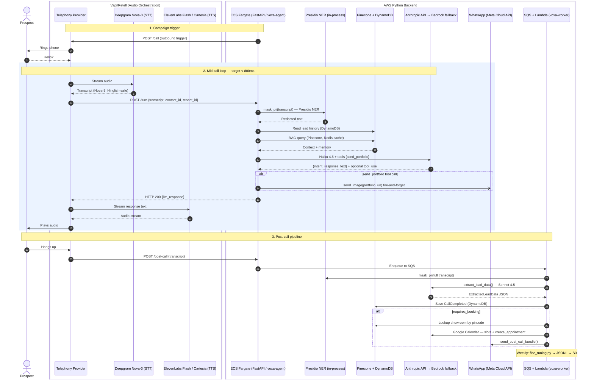

# AI Voice Agent Call Flow

The real-time execution of an outbound AI phone call.
Vapi/Retell handles all audio — the Python backend
only processes text.

```mermaid
sequenceDiagram
  autonumber
  actor Prospect
  box Vapi/Retell (Audio Orchestration)
    participant Vapi as Telephony Provider
    participant STT as Deepgram Nova-3 (STT)
    participant TTS as ElevenLabs Flash / Cartesia (TTS)
  end
  box AWS Python Backend
    participant ECS as ECS Fargate (FastAPI / voxa-agent)
    participant PII as Presidio NER (in-process)
    participant DB as Pinecone + DynamoDB
    participant LLM as Anthropic API → Bedrock fallback
    participant WA as WhatsApp (Meta Cloud API)
    participant Worker as SQS + Lambda (voxa-worker)
  end

  Note over ECS, Vapi: 1. Campaign trigger
  ECS->>Vapi: POST /call (outbound trigger)
  Vapi->>Prospect: Rings phone
  Prospect-->>Vapi: Hello?

  rect rgb(235, 243, 255)
    Note over Prospect, LLM: 2. Mid-call loop — target < 800ms
    Vapi->>STT: Stream audio
    STT-->>Vapi: Transcript (Nova-3, Hinglish-safe)
    Vapi->>ECS: POST /turn {transcript, contact_id, tenant_id}
    ECS->>PII: mask_pii(transcript) — Presidio NER
    PII-->>ECS: Redacted text
    ECS->>DB: Read lead history (DynamoDB)
    ECS->>DB: RAG query (Pinecone, Redis cache)
    DB-->>ECS: Context + memory
    ECS->>LLM: Haiku 4.5 + tools [send_portfolio]
    LLM-->>ECS: {intent, response_text} + optional tool_use
    alt send_portfolio tool call
      ECS-)WA: send_image(portfolio_url) fire-and-forget
    end
    ECS-->>Vapi: HTTP 200 {llm_response}
    Vapi->>TTS: Stream response text
    TTS-->>Vapi: Audio stream
    Vapi->>Prospect: Plays audio
  end

  Note over Prospect, Worker: 3. Post-call pipeline
  Prospect->>Vapi: Hangs up
  Vapi->>ECS: POST /post-call {transcript}
  ECS->>Worker: Enqueue to SQS
  Worker->>PII: mask_pii(full transcript)
  Worker->>LLM: extract_lead_data() — Sonnet 4.5
  LLM-->>Worker: ExtractedLeadData JSON
  Worker->>DB: Save CallCompleted (DynamoDB)
  alt requires_booking
    Worker->>DB: Lookup showroom by pincode
    Worker->>LLM: Google Calendar — slots + create_appointment
    Worker->>WA: send_post_call_bundle()
  end
  Note over Worker: Weekly: fine_tuning.py → JSONL → S3
```
