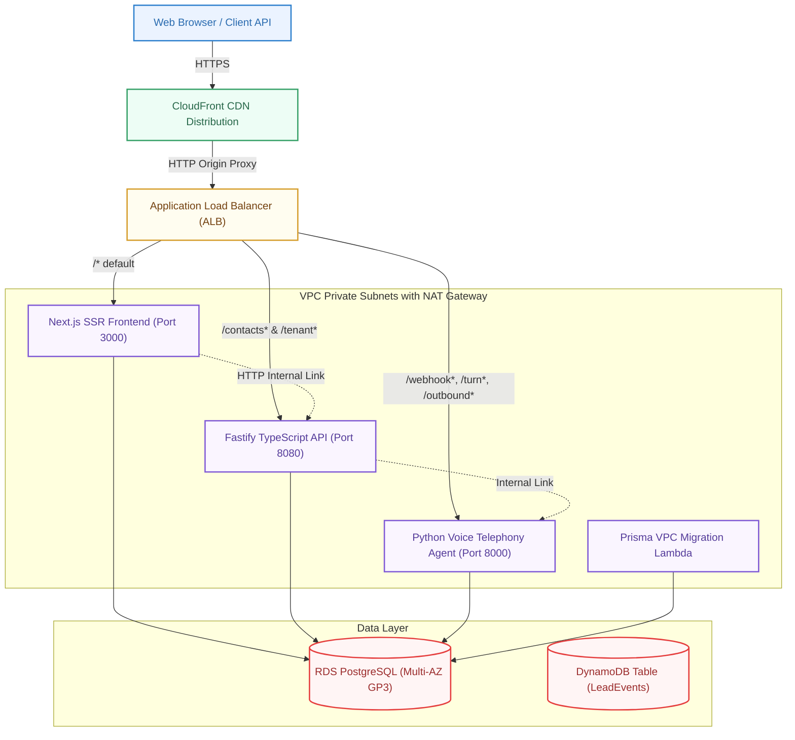

# VOXA — High-Availability Container Architecture

VOXA has migrated from serverless edge/lambda setups to a robust, fully-containerized architecture deployed on **AWS ECS Fargate**, hardened for high-throughput production environments, and isolated from Vercel dependencies.



---

## 1. Application Load Balancer Routing Rules

The shared Application Load Balancer (ALB) serves as the primary ingress router for the platform. It handles the following path patterns:

| Endpoint Path | Destination Service | Destination Port | Description |
| :--- | :--- | :--- | :--- |
| `/*` (Default) | Next.js Service | `3000` | Server-Side Rendered (SSR) Frontend & UI Pages |
| `/contacts*` | Fastify Service | `8080` | Contacts Database CRUD & Bulk Operations |
| `/tenant*` | Fastify Service | `8080` | Tenant Configurations & Management |
| `/webhook*` | Python Voice Agent | `8000` | Telephony Call State & Stream Ingress Webhooks |
| `/turn*` | Python Voice Agent | `8000` | Real-time RAG Agent Dialogue Turn Router |
| `/outbound*` | Python Voice Agent | `8000` | Telephony Outbound Campaign Call Ingress |

---

## 2. Internal Service Discovery

Services communicate internally within the VPC using **AWS Cloud Map** private DNS under the private namespace `voxa.internal`. This avoids public load balancer roundtrips, ensures lower latency, and adds an extra layer of security.

- **Fastify Backend URL**: `http://fastify.voxa.internal:8080`
- **Python Agent URL**: `http://agent.voxa.internal:8000`

---

## 3. Database Migration Runner (VPC Lambda)

For security, the RDS PostgreSQL database is isolated in private subnets and is not accessible from the public internet.

Database migrations are executed safely inside the VPC using a dedicated **NodeJS 20.x Lambda function (`MigrateFn`)**.
During deployment, the unified GitHub Actions pipeline invokes the Lambda:
```bash
aws lambda invoke --function-name <MigrateFnArn> out.json
```
The Lambda runs `npx prisma migrate deploy` locally within the private subnet, securing database credentials via IAM policy injection.

---

## 4. Production RDS Hardening

The PostgreSQL 16 database stack has been upgraded with the following production features:
- **GP3 Storage**: High performance storage configured at 200GB (from GP2 100GB).
- **Multi-AZ Replication**: Enabled for high availability and zero-data-loss failover.
- **Scale Up**: Upgraded database instance type to `t4g.small` (from `t4g.micro`).
- **Deletion Protection**: Enabled to prevent accidental database deletion.
- **Log Exports**: Configured automatic exports of Postgres logs and upgrade logs to CloudWatch.

---

## 5. ECR Repository and Image Lifecycle

To control storage costs, all ECR repositories (`voxa-nextjs`, `voxa-fastify`, and `voxa-agent`) are protected by lifecycle policies:
- Retains at most the **10 most recent** image tags.
- Automatically prunes older untagged or expired images.
