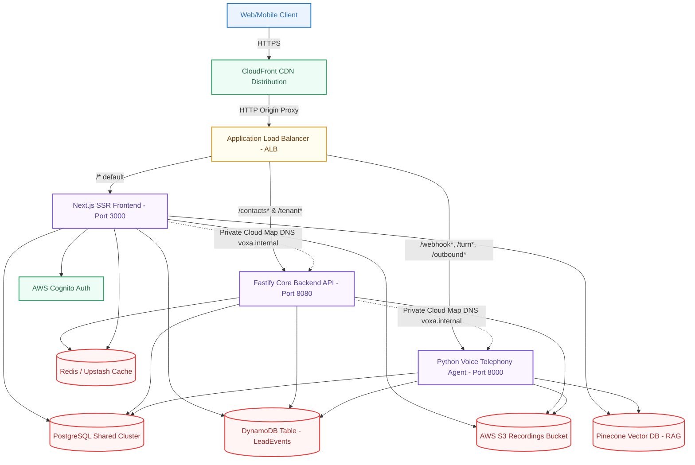

# VOXA Platform Container Architecture

This diagram outlines the high-level system topology of the containerized VOXA SaaS platform, illustrating how traffic is served securely and routed from the edge through CloudFront and the shared Application Load Balancer into individual ECS Fargate service groups.

