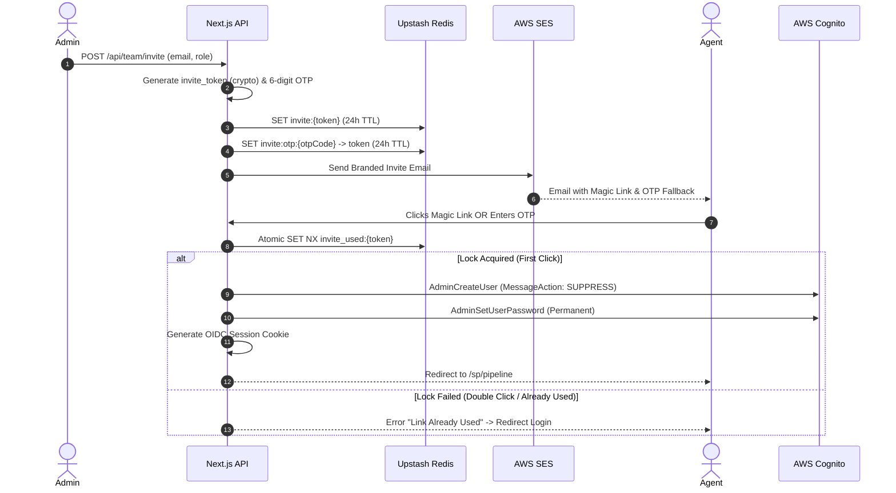

# Team Invite Auth Flow

This document outlines the standard operating procedure for onboarding internal `SALES_AGENT` and `READ_ONLY` team members into an existing tenant's isolated environment.

Because these agents receive unexpected invites on unfamiliar devices (and often rely on mobile email clients), this flow explicitly abandons traditional Temp Password flows in favor of a strictly enforced **Magic Link + Email OTP Fallback** pattern.

## Why Magic Links over Cognito Temp Passwords?
1. **User Experience**: Temp passwords generate generic, poorly branded emails. Forcing a non-technical sales agent to copy a plaintext credential, paste it, and immediately be forced into a "Change Password" challenge is high friction.
2. **Context Preservation**: A one-click magic link establishes the user's session natively in their browser, removing the "login wall" entirely.

## Flow Diagram

## Security & Deliverability Considerations

### 1. The Mobile Deeplink Problem
When a user clicks a magic link inside an email client like Gmail on Android, it often opens in an embedded in-app browser rather than the default Chrome session. This isolates the session cookie to the in-app browser. If the user then tries to open the app in their main browser, they are logged out.

**Solution:** The 6-digit Email OTP Fallback. The invite email explicitly provides an OTP. If the magic link fails or sets context in the wrong browser, the user can manually navigate to `voxa.ai/accept-invite` in their preferred browser and enter the OTP to establish the correct session.

### 2. Atomic Double-Invalidation (Race Conditions)
Due to network latency, users frequently double-click magic links. If the backend reads a flag, processes Cognito, and then writes the flag, two parallel requests might both succeed, causing duplicate Cognito provisioning or unpredictable state.

**Solution:** Token invalidation is atomic. We use Redis `SET NX` (Set if Not eXists) on a specialized lock key (`invite_used:{token}`). The first request acquires the lock and proceeds. The second request immediately fails the `SET NX` check and is cleanly rejected as "already used".

### 3. AWS SES Deliverability in India
Since this flow relies entirely on the invite email, deliverability is critical. Standard AWS SES emails without proper domain alignment will frequently land in spam, particularly for agents using Jio-hosted mailboxes or strict corporate firewalls.

**Solution:**
- **SPF (Sender Policy Framework)**: Must be configured to explicitly authorize AWS SES IPs for the `voxa.ai` domain.
- **DKIM (DomainKeys Identified Mail)**: AWS SES must sign outbound emails with a cryptographic key matching the `voxa.ai` DNS records.
- **DMARC (Domain-based Message Authentication, Reporting, and Conformance)**: Must be set to `p=quarantine` or `p=reject` to protect domain reputation, ensuring receiving servers trust the magic links.
